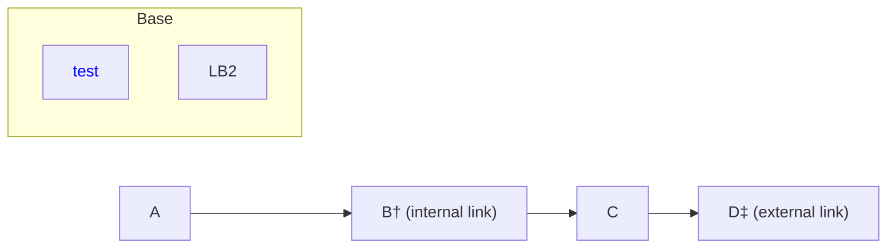

```mermaid
    graph LR
        style LB1 color:blue
        subgraph 1[Base]
            LB1["test"];
            LB2
        end
        click LB1 "https://x.com/"
       
        A-->B["B#dagger; (internal link)"];
        B-->C;
        C-->D["D#ddagger; (external link)"];
        click B "https://google.com"
        click D "https://gist.github.com/ChristopherA/"

```   
