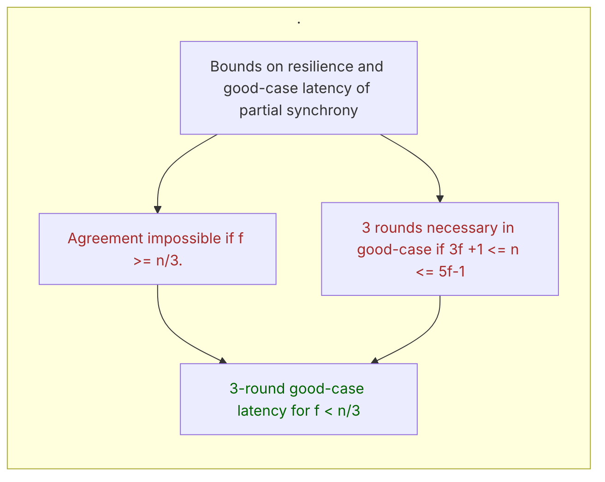

```mermaid
    %%{init: {'themeVariables': { 'fontSize': '16px', 'fontFamily': 'Inter'}}}%%
    graph LR
        style LB1 color:brown
        style LB2 color:brown
        style UB1 color:darkgreen
        subgraph 1[.]
            BaseTitle["Bounds on resilience and good-case latency of partial synchrony"]
        
        
            LB1["Agreement impossible if f >= n/3."];
            LB2["3 rounds necessary in good-case if 3f +1 <= n <= 5f-1"];
            UB1["3-round good-case latency for f < n/3"]
            BaseTitle-->LB1
            BaseTitle-->LB2
            LB1-->UB1
            LB2-->UB1
        end
        
        click LB1 href "https://decentralizedthoughts.github.io/2019-06-25-on-the-impossibility-of-byzantine-agreement-for-n-equals-3f-in-partial-synchrony/" _blank
        click LB2 href "https://decentralizedthoughts.github.io/2021-02-28-good-case-latency-of-byzantine-broadcast-a-complete-categorization/" _blank
        click UB1 href "https://decentralizedthoughts.github.io/2025-02-14-PBFT/" _blank
```
